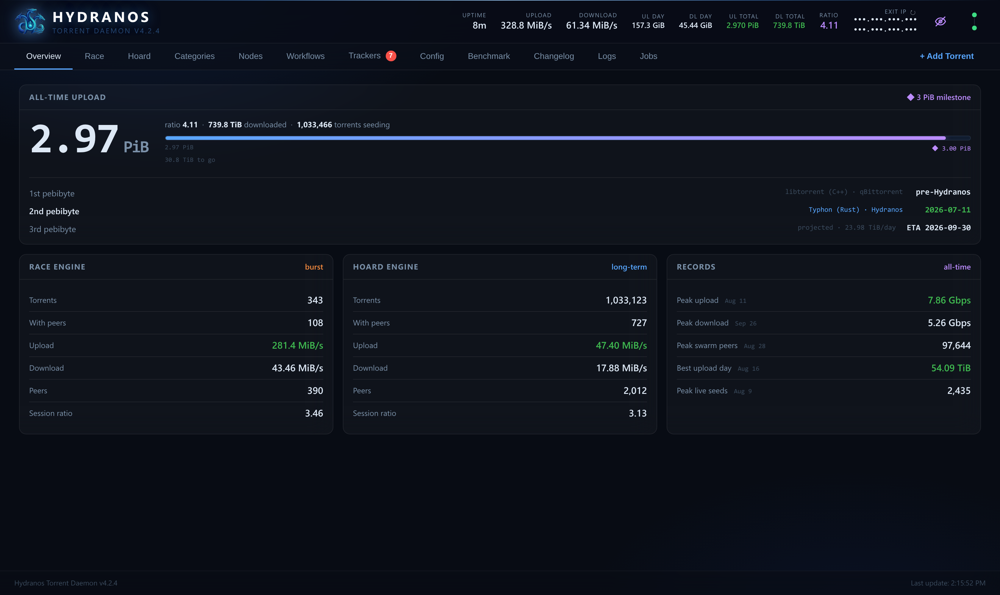
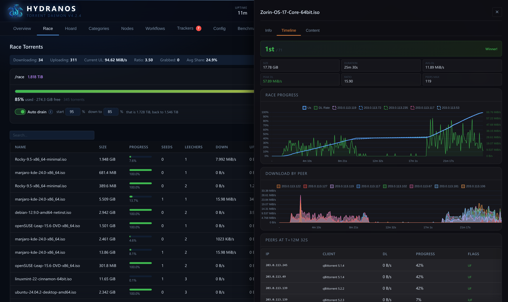
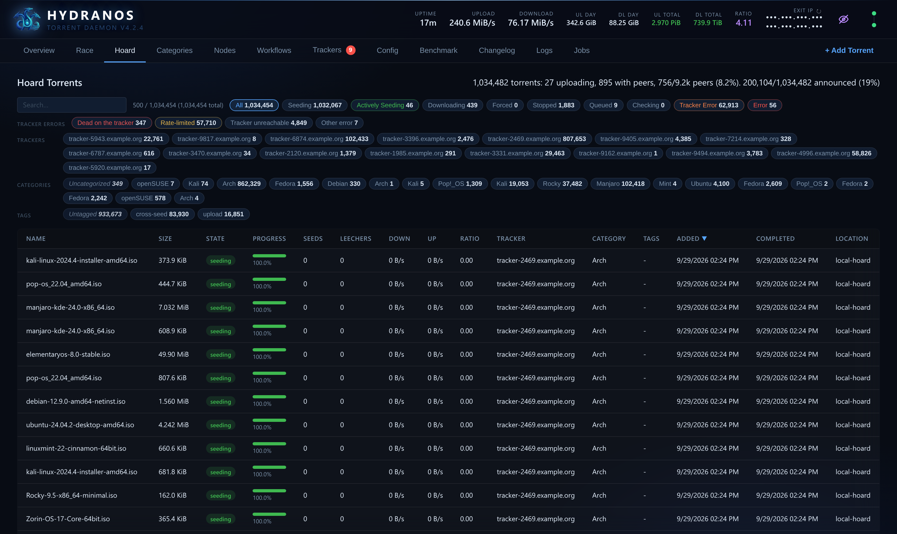
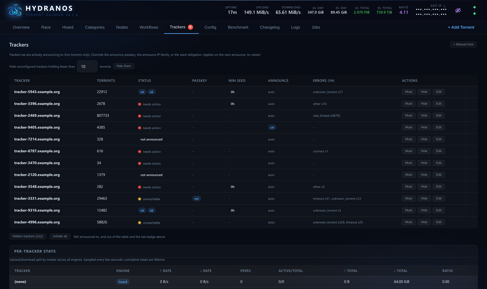
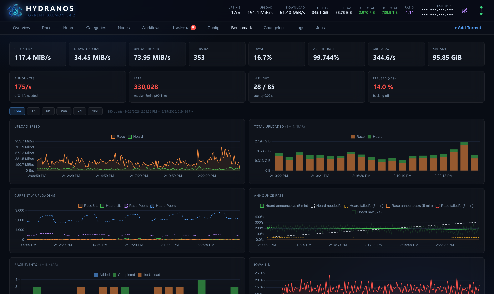
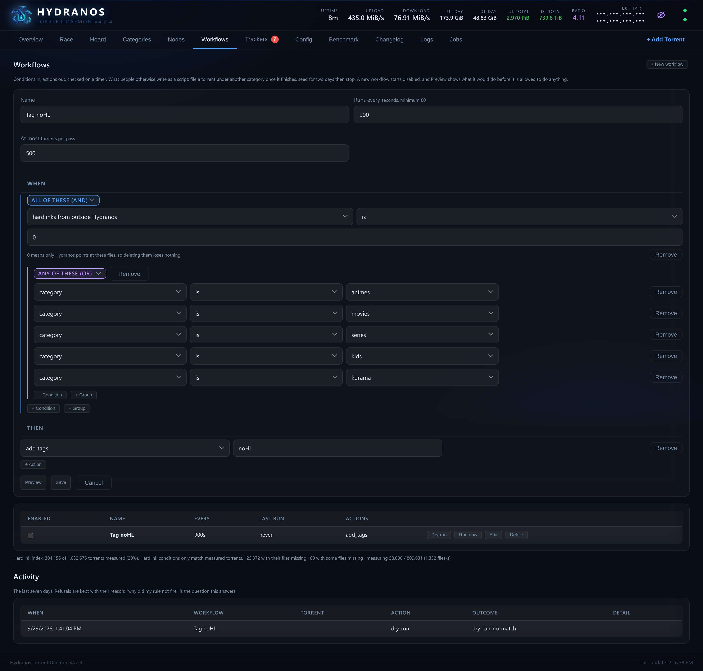

# Hydranos

A self-hosted BitTorrent daemon built for **scale and seeding**: one Rust
process ("Typhon") holding a very large catalogue and keeping every torrent of
it announced. Hydranos runs **over a million torrents in a single instance** in
production today. It exposes a live web
UI, a native REST API, and a qBittorrent-compatible shim so your existing
`*arr` / autobrr / cross-seed setup keeps working unchanged.

> Status: opened up from a private homelab project. It is used in production
> but some rough edges remain; issues and PRs welcome.

---

## Why Hydranos?

Most BitTorrent clients are designed around a few thousand torrents, and do
that very well. At hundreds of thousands the constraints change: how long the
client takes to start, and whether every torrent is still announced on
schedule. A torrent the tracker has not heard about is a torrent nobody
downloads from you. Hydranos is built around those two constraints, and around
three uses of one instance:

- **Hoard.** Seed a very large library and keep all of it announced: over
  a million torrents in production today.
- **Race.** Grab and seed new releases fast. Hydranos runs a *race* engine and
  a *hoard* engine side by side in one process, each tuned for its job, so a
  large library never slows a race down.
- **Stay light.** Serving 50,000 torrents takes 877 MiB of RAM (about
  18 KiB per torrent) and 0.12 of a CPU core; holding 290,000 takes 2.8 GiB
  (about 10 KiB per torrent).

How Hydranos and other clients behave at [50,000](docs/benchmarks.md) and
[290,000 torrents](docs/scale-290k.md), measured on the same machine.

And your automation keeps working: the qBittorrent v2 API shim means
Sonarr/Radarr, autobrr and cross-seed talk to Hydranos unchanged.

If you seed a few hundred torrents, qBittorrent or Transmission will serve you
with less to learn.

Also in the box: SOCKS5 / PROXY-v2 relay / gluetun networking with hot
listen-port rebind, engines spread over several machines behind one front, and
adds that hash-check data already on disk instead of downloading over it.

---

## For tracker operators

What Hydranos puts on the wire is documented, rule by rule, in
**[`docs/BITTORRENT-CONFORMANCE.md`](docs/BITTORRENT-CONFORMANCE.md)**. Every
claim there names the test that asserts it: the unit suite runs offline in
seconds, and `tools/interop/run.sh` runs the client against opentracker,
Torrust in private mode and qBittorrent/libtorrent, reading the verdict from
their state rather than ours. Both run on every push. In short:

- **Session counters.** `uploaded`/`downloaded` count from `started`, never
  the lifetime total; `left` comes from the pieces held.
- **BEP 3 events per tracker.** `started`, `completed` (once, to every tracker
  that saw us leech, retried if one is down) and `stopped`; a cross-seed is
  never a snatch.
- **Your floors hold.** `min interval`, BEP 31 `retry in` and `Retry-After` are
  obeyed per tracker, manual re-announces included; BEP 12 tier order is
  respected; `tracker id` is echoed back.
- **One identity.** Peer id `-HY####-`, the same to every tracker and every
  peer, `User-Agent: Hydranos/<version>`, a stable secret `key`. No client
  spoofing.
- **Private torrents stay private** (BEP 27): no DHT, PEX, hole punching or
  LSD, and peers named by other peers are ignored.
- **HTTP trackers only.** No UDP, and no scrape requests: swarm counts come
  from the announce response.

---

## Screenshots

All screenshots below are taken with **incognito mode on**: torrent names,
categories, paths, IPs and tracker hostnames are replaced by stable fakes.

**Overview** — live dashboard: global up/down, seeding/leeching counts,
per-session throughput.

**Race** — one finished race in detail: where it placed in the swarm, how
the download went, which peers it came from, and what it has uploaded since.

**Hoard** — the long-term seeding library, filtered by tracker, state and
category.

**Trackers** — one row per tracker actually announced to: passkey override,
announce IP family, seed obligation, and the errors seen in the last hour.

**Benchmark** — traffic per engine, disk and cache health, and whether the
announces keep up with the catalogue, from fifteen minutes to thirty days;
plus a line speedtest and a before/after comparison around a change.

**Workflows** — rules over the library, built from conditions and actions and
previewed before they run. Here: tag every torrent in the media categories whose
files have no hardlink outside Hydranos, i.e. that can be deleted without
losing anything.

---

## Documentation

Install steps, architecture, every networking mode and the edge cases live in
the **[Wiki](https://github.com/Kheopsian/Hydranos/wiki)**:

- [Installation & First Run](https://github.com/Kheopsian/Hydranos/wiki/Installation-and-First-Run)
- [Architecture](https://github.com/Kheopsian/Hydranos/wiki/Architecture)
- [Networking Modes](https://github.com/Kheopsian/Hydranos/wiki/Networking-Modes)
- [Deployment Topologies](https://github.com/Kheopsian/Hydranos/wiki/Deployment-Topologies)
- [Categories & Routing](https://github.com/Kheopsian/Hydranos/wiki/Categories-and-Routing)
- [Adding Torrents & Existing Data](https://github.com/Kheopsian/Hydranos/wiki/Adding-Torrents-and-Existing-Data)
- [qBittorrent Shim & Automation](https://github.com/Kheopsian/Hydranos/wiki/qBittorrent-Shim-and-Automation)
- [Configuration Reference](https://github.com/Kheopsian/Hydranos/wiki/Configuration-Reference)
- [Troubleshooting](https://github.com/Kheopsian/Hydranos/wiki/Troubleshooting)

API reference: [`docs/API.md`](docs/API.md). Companion VPS relay:
[hydra-relay](https://github.com/Kheopsian/hydra-relay).

---

## License

Hydranos is licensed under the **GNU Affero General Public License v3.0** (AGPL-3.0).
See [`LICENSE`](LICENSE). In short: you're free to run, study, modify, and
share it, including self-hosting a modified version, but if you offer a modified
Hydranos to others over a network, you must make your source available under the
same license.
